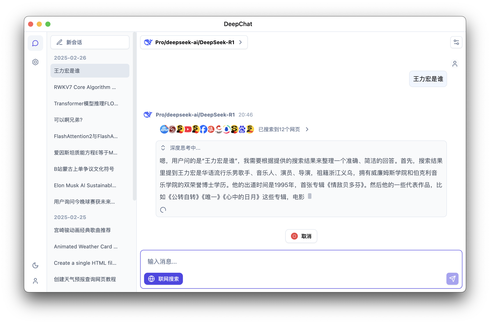
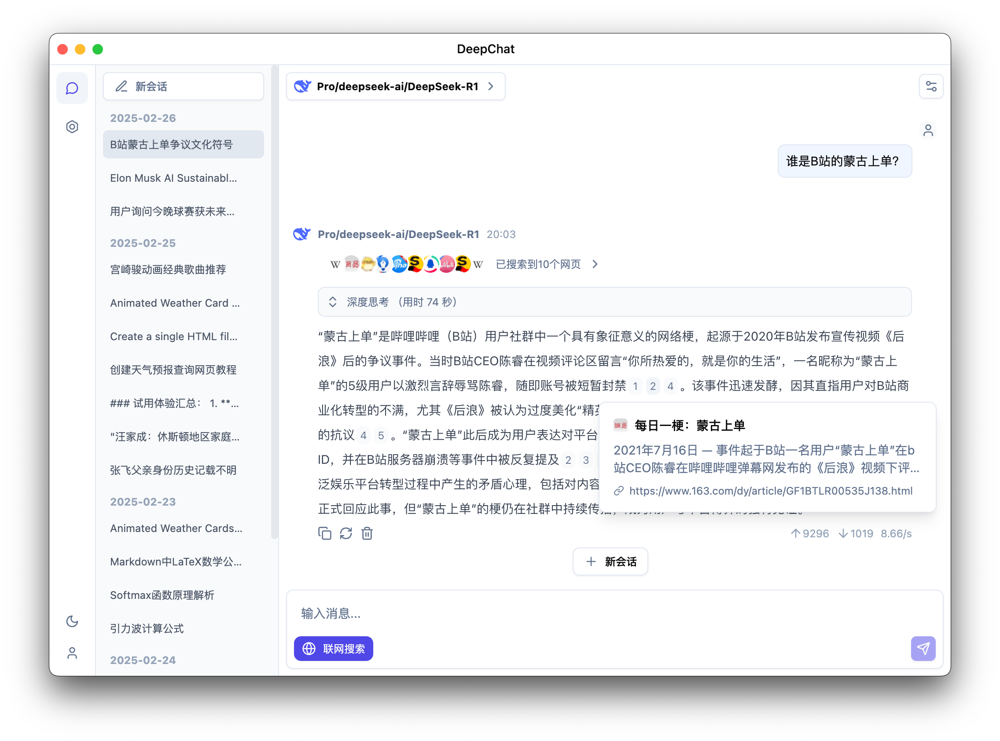
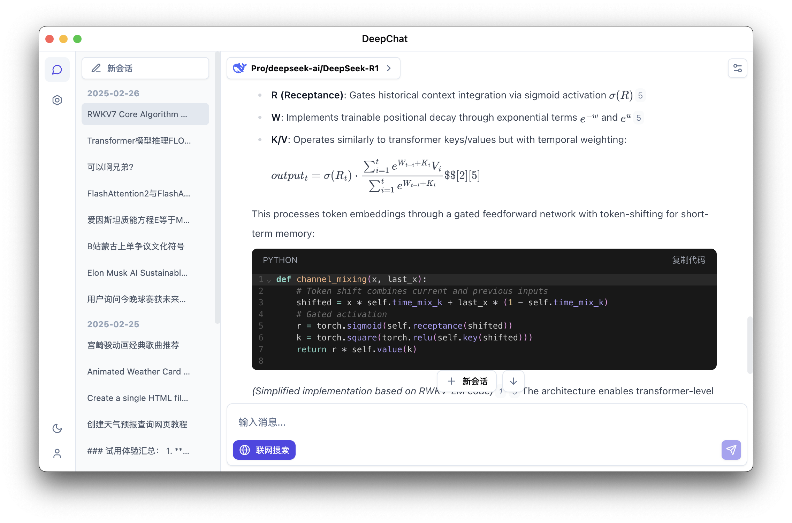
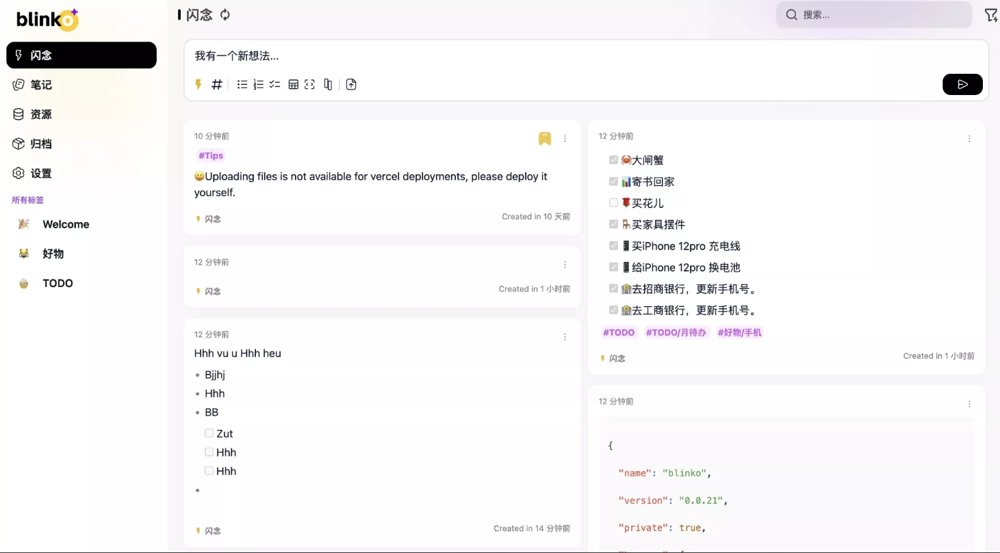

<p align='center'>

</p>

<h1 align="center">拾光oi</h1>

<p align="center">拾光是一个跨平台的'思考+互联+记录'的实验室AI助手类客户端，致力于让更多人便捷地使用AI</p>

<div align="center">
  中文 / <a href="./README.md">English</a>
</div>

### 深度思考

<p align='center'>

</p>

### 支持搜索 (纯本地直接向搜索引擎发起)

<p align='center'>

</p>

### Latex 公式支持

<p align='center'>

</p>

### 闪念笔记
<p align='center'>

</p>


## 主要特性

- 🌐 支持多个模型云服务：DeepSeek、OpenAI、硅基流动等
- 🏠 支持本地模型部署：Ollama
- 🚀 多路聊天并发支持，无需等待模型生成完毕便可以切换到其他会话，效率Max
- 💻 支持多平台：Windows、macOS、Linux
- 📄 完整的 Markdown 渲染，优秀的代码模块渲染
- 🌟 简单易用，完善的引导页，不了解复杂的概念也能立刻上手
- 😄习惯惯比灵感可靠

>在实践卡片笔记的过程中，我们越来越有一个深刻的体会：卢曼的卡片笔记这套方法论的实践，选择用哪个工具并不是最重要的，真正重要的是能不能把这套方法论形成我们的日常习惯，然后持之以恒地去实践。


>在实践卡片笔记的过程中，我们觉得有几个习惯是比较重要的：记录笔记的习惯、回顾笔记的习惯、在回顾过程中迭代笔记的习惯。有了记录笔记的习惯，我们就可以随时随地把自己的想法写下来，让思考“有迹可循”；有了回顾笔记的习惯，我们就可以把记录下来的笔记，内化到自己的知识结构中去，形成一个完整的结构，而不再是零散的知识点；有了不断迭代笔记的习惯，我们就可以在旧思考的基础上不断迭代新思考，让认知不断进化，真正体会到知识的复利效应。

>意识到习惯这个点的重要性之后，我们逐渐形成的一个共识是，我们要做的拾光oi，从形态是来讲它是一个卡片笔记工具，从逻辑上来讲它是一个帮助人们培养记录笔记、回顾笔记和迭代笔记习惯的工具。

>在拾光oi这个产品中，通过打造“日拱一卒”的场景，把通过笔记来提升思考、提升认知的行为，培养成每日的习惯性动作，让我们真正感受到笔记的力量，这是我们做 reminds 这个产品的第二个底层逻辑。

## 目前支持的模型供应商

<table>
  <tr align="center">
    <td>
      <br/>
      <a href="https://ollama.com">Ollama</a>
    </td>
    <td>
      <br/>
      <a href="https://deepseek.com/">Deepseek（深度求索）</a>
    </td>
    <td>
      <br/>
      <a href="https://www.siliconflow.cn/">硅基流动</a>
    </td>
    <td>
      <br/>
      <a href="https://chat.qwenlm.ai">QwenLM</a>
    </td>
  </tr>
  <tr align="center">
    <td>
      <br/>
      <a href="https://console.volcengine.com/ark/">火山引擎</a>
    </td>
    <td>
      <br/>
      <a href="https://minimaxi.com/">MiniMax大模型</a>
    </td>
    <td>
      <br/>
      <a href="https://fireworks.ai/">Fireworks</a>
    </td>
    <td>
      <br/>
      <a href="https://ppinfra.com/">PPIO派欧云</a>
    </td>
  </tr>
  <tr align="center">
    <td>
      <br/>
      <a href="https://openai.com/">OpenAI</a>
    </td>
    <td>
      <br/>
      <a href="https://gemini.google.com/">Gemini</a>
    </td>
    <td>
      <br/>
      <a href="https://github.com/marketplace/models">GitHub Models</a>
    </td>
    <td>
      <br/>
      <a href="https://moonshot.ai/">Moonshot</a>
    </td>
  </tr>
  <tr align="center">
    <td>
      <br/>
      <a href="https://openrouter.ai/">OpenRouter</a>
    </td>
    <td>
      <br/>
      <a href="https://azure.microsoft.com/en-us/products/ai-services/openai-service">Azure OpenAI</a>
    </td>
    <td colspan="2">
      兼容任意 openai/gemini 格式API的供应商
    </td>
  </tr>
</table>

## 即将推出（TODO）

- [x] 支持 Ollama 本地模型管理
- [ ] 支持 llama.cpp 本地模型
- [x] 支持本地文件处理
- [x] Mermaid 图表可视化
- [x] 搜索集成（本地+云端API）
- [ ] MCP支持
- [x] 多模态模型支持
- [ ] 本地聊天数据同步和加密

## 开发

请先阅读 [贡献指南](./CONTRIBUTING.zh.md)

### 安装依赖

```bash
$ npm install
# for windows x64
$ npm install --cpu=x64 --os=win32 sharp
# for mac apple silicon
$ npm install --cpu=arm64 --os=darwin sharp
# for mac intel
$ npm install --cpu=x64 --os=darwin sharp
# for linux x64
$ npm install --cpu=x64 --os=linux sharp
```

### 开始开发

```bash
$ npm run dev
```

### 构建

```bash
# For windows
$ npm run build:win

# For macOS
$ npm run build:mac

# For Linux
$ npm run build:linux

# 指定架构打包
$ npm run build:win:x64
$ npm run build:win:arm64
$ npm run build:mac:x64
$ npm run build:mac:arm64
$ npm run build:linux:x64
$ npm run build:linux:arm64
```


# 📃 许可证

[LICENSE](./LICENSE)
